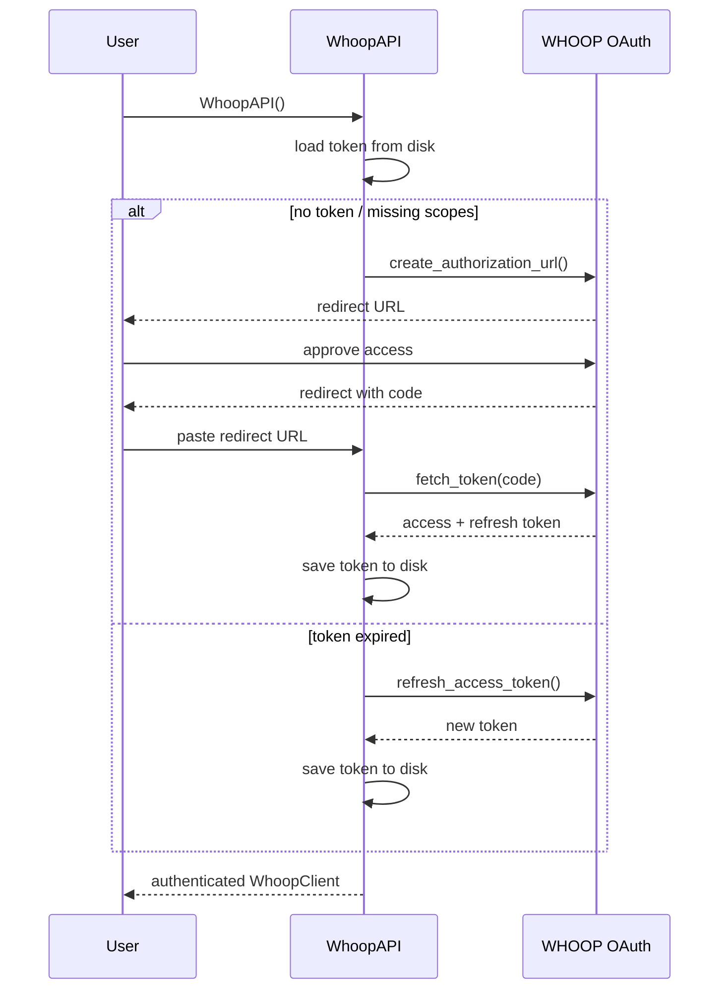

# whoop-py

Python client for the [WHOOP API](https://developer.whoop.com/api) with OAuth 2.0 support and token persistence.

## Installation

```bash
pip install whoop-py
```

## Setup

Register your app at [developer.whoop.com](https://developer.whoop.com) to get a `CLIENT_ID`, `CLIENT_SECRET`, and `REDIRECT_URI`.

Pass credentials directly or via environment variables:

```bash
export CLIENT_ID=your_client_id
export CLIENT_SECRET=your_client_secret
export REDIRECT_URI=your_redirect_uri
```

## Usage

```python
from whoop_py import WhoopAPI

with WhoopAPI(
    client_id="your_client_id",
    client_secret="your_client_secret",
    redirect_uri="your_redirect_uri",
) as api:
    sleep = api.get_sleep_collection(start_date="2026-06-01")
    recovery = api.get_recovery_collection()
    workouts = api.get_workout_collection()
```

Or with environment variables / `.env` file:

```python
from dotenv import load_dotenv
from whoop_py import WhoopAPI

load_dotenv()

with WhoopAPI() as api:
    profile = api.get_profile()
    print(profile)
```

The first run opens an interactive OAuth flow and saves the token to `.whoop_token.json`. Subsequent runs reuse or auto-refresh it.

## Auth Flow



## API Reference

### `WhoopAPI` (recommended)

High-level client with token persistence and auto-refresh.

| Method | Description |
|---|---|
| `get_profile()` | User profile |
| `get_body_measurement()` | Height, weight, max HR |
| `get_sleep_collection(start, end)` | All sleep records |
| `get_sleep_by_id(id)` | Single sleep record |
| `get_sleep_stream(id)` | Raw HR/temp signal stream |
| `get_recovery_collection(start, end)` | All recovery scores |
| `get_recovery_for_cycle(cycle_id)` | Recovery for a specific cycle |
| `get_current_recovery()` | Most recent recovery score |
| `get_cycle_collection(start, end)` | All physiological cycles |
| `get_cycle_by_id(id)` | Single cycle |
| `get_workout_collection(start, end)` | All workouts |
| `get_workout_by_id(id)` | Single workout |

`start` / `end` are ISO date strings (e.g. `"2026-06-01"`). Defaults to the last 7 days.

### `WhoopClient` (low-level)

Direct OAuth2 session wrapper for custom token management or headless use.

```python
from whoop_py import WhoopClient

client = WhoopClient(
    client_id="...",
    client_secret="...",
    redirect_uri="...",
    token=my_existing_token,
    authenticate=False,
)
sleep = client.get_sleep_collection(start_date="2026-06-01")
```

## Custom Token Path

```python
from whoop_py import WhoopAPI

api = WhoopAPI(token_path="/path/to/my_token.json")
```

## Custom Scopes

```python
from whoop_py import WhoopAPI

api = WhoopAPI(scopes={"offline", "read:sleep", "read:recovery"})
```

## License

MIT
